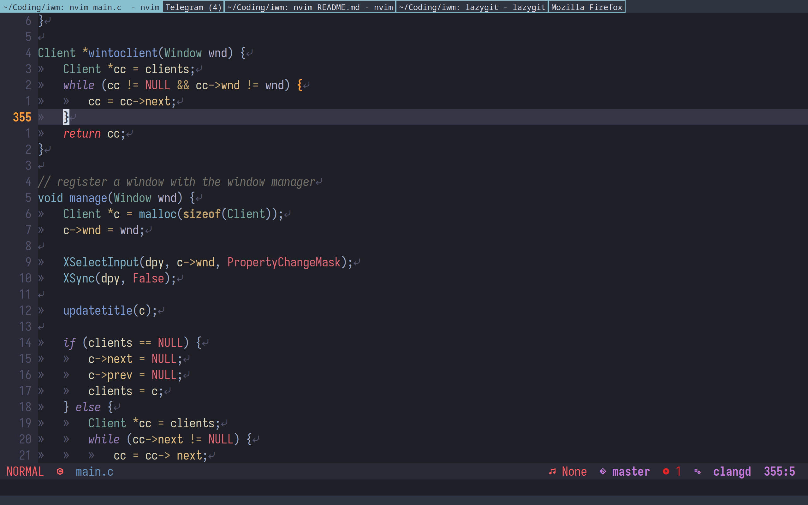

# IWM - Ivan's Window Manager
IWM is a simple window manager for X11 with Xinerama support written in C with [Xlib](https://www.x.org/releases/current/doc/libX11/libX11/libX11.html). It has roughly 1000 lines of code(with coments and empty lines). It is inspired by dwm. It is designed to be a bare-bones start for people to build upon as they need. It operates on a single linked list of fullscreen windows, which the user can move around and swap. It has a simple statusbar at the top of the screen that displays the list of windows with the focused one being highlighted.

# Installation
To install IWM, clone the repository and run `make build` in the root directory. This will create the `iwm` executable. To install the executable, run `sudo make install`.

# Configuration
IWM is configured by directly editing the source code. There are some configuration options at the top of `main.c` that can be changed to suit your needs. The configuration options are:
- `border_width`: The width of the window borders in pixels.
- `bar_height`: The height of the statusbar.
- `fontname`: The font used to draw the statusbar.
- `fg_color_const`: Foreground color.
- `bg_color_const`: Background color.
- `primary_color_const`: Primary accent color.

## Other options
Some other options have to be configured in other places, which I have not yet refactored into variables. These include the terminal emulator and run menu.

## "Startup script"
Other window managers can have some kind of script that runs on startup. IWM has a simple function called `init`, which has some defaults, which i recommend to change.

## Keybindings
Keybindings are configured in the `grabkeys` and `keypress` functions in `main.c`. The default keybindings are:
- `MOD4 + Enter`: Open terminal emulator.
- `MOD4 + q`: Close focused window.
- `MOD4 + Space`: Open run menu.
- `MOD4 + k`: Focus window to the left.
- `MOD4 + l`: Focus window to the right.
- `MOD4 + Shift + k`: Swap with left window.
- `MOD4 + Shift + l`: Swap with right window.
- `MOD4 + Control + r`: Restart the wm.
- `MOD4 + Control + Shift + q`: Quit the wm.
- `MOD4 + period`: focus next monitor.
- `MOD4 + comma`: focus previous monitor.
- `MOD4 + Shift + period`: move focused client to next monitor.
- `MOD4 + Shift + comma`: move focused client to previous monitor.

# Screenshots

